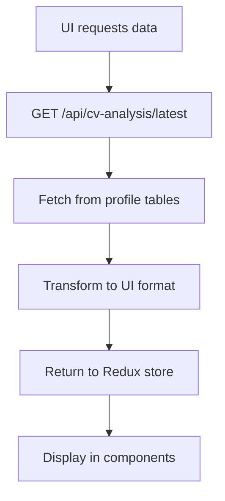
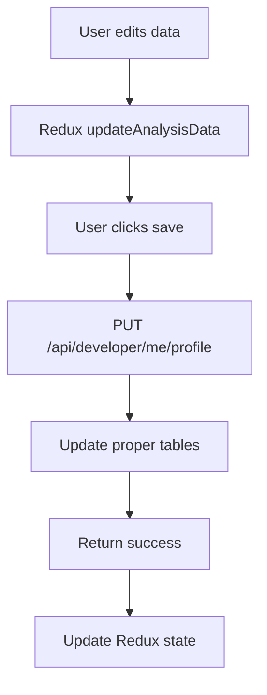

# TechRec System Architecture

A comprehensive AI-powered tech recruitment platform with sophisticated gamification, built on modern web technologies and single source of truth data architecture.

## 🏗️ **Core Technology Stack**

### Frontend Framework
- **Next.js 15.2+** with App Router
- **TypeScript** (strict mode)
- **TailwindCSS 4** + **DaisyUI** components
- **Framer Motion** for animations
- **Redux Toolkit** with persistence

### Backend & Database
- **Next.js API routes** with serverless functions
- **MongoDB** with **Prisma ORM** (6.6.0)
- **Redis** (ioredis) for caching and configuration
- **AWS S3** for file storage

### AI Integration
- **Dual Provider System**: OpenAI + Google Gemini
- **Dynamic prompts** with context-aware generation
- **Semantic caching** for performance optimization

### Authentication & Payments
- **NextAuth.js** with OAuth providers
- **Stripe** integration with webhook security

---

## 🎯 **Platform Overview**

**TechRec** is a comprehensive recruitment platform featuring:

- **Multi-stage CV analysis** with ATS scoring and actionable feedback
- **AI-powered content generation** (cover letters, outreach messages)
- **Batch application workflows** with progress tracking
- **Comprehensive gamification system** with XP progression and achievements
- **Subscription tiers** with points-based premium features
- **Real-time state management** with Redux persistence

---

## 📊 **Database Architecture (Single Source of Truth)**

### Core Profile Tables
```prisma
Developer {
  id, name, email, title, about
  totalXP, currentLevel, subscriptionTier
  contactInfo: ContactInfo (1:1)
  experience: Experience[] (1:Many)
  education: Education[] (1:Many)
  achievements: Achievement[] (1:Many)
  developerSkills: DeveloperSkill[] (Many:Many via junction)
}

Experience {
  id, title, company, description, location
  startDate, endDate, current
  responsibilities[], achievements[]
  teamSize, techStack[]
}

Education {
  id, degree, institution, year, location
  startDate, endDate, gpa
  honors[], activities[]
}

DeveloperSkill {
  developerId, skillId, level
  skill: Skill { name, category }
}
```

### File Management
```prisma
CV {
  id, developerId, filename, originalName
  s3Key, mimeType, size, status
  extractedText, improvementScore
}
```

### Gamification System
```prisma
Developer {
  totalXP, currentLevel, subscriptionTier
  monthlyPoints, pointsUsed, pointsEarned
}

XPTransaction { amount, source, description }
PointsTransaction { amount, source, spendType }
UserBadge { badgeId, earnedAt, progress }
```

---

## 🔄 **Data Flow Architecture**

### CV Upload & Analysis Pipeline
```mermaid
graph TD
    A[User uploads CV] --> B[POST /api/cv/upload]
    B --> C[Upload to S3]
    C --> D[Create CV record]
    D --> E[Parse file content]
    E --> F[AI Analysis (Gemini/OpenAI)]
    F --> G[Background Profile Sync]
    G --> H[Save to proper tables]
    H --> I[Developer, Experience, Education, Skills]
```

### Data Retrieval


### Save Operations


---

## 🔌 **API Architecture**

### Profile Management (Single Source of Truth)
```typescript
// Proper CRUD APIs for profile data
GET    /api/developer/me/profile      // Full profile
GET    /api/developer/me/experience   // Experience list
POST   /api/developer/me/experience   // Add experience
PUT    /api/developer/me/experience/[id] // Update experience
DELETE /api/developer/me/experience/[id] // Delete experience

// Similar patterns for education, skills, achievements
```

### Legacy Compatibility
```typescript
// Maintains UI compatibility during transition
GET /api/cv-analysis/latest // Fetches from profile tables, transforms to legacy format
```

### Authentication & Security
- **Session-based auth** with NextAuth.js
- **Development mode** fallback with mock developer ID
- **API route protection** with session validation
- **Zod schema validation** for all inputs

---

## 🎮 **Gamification Architecture**

### Dual-Progression System
- **XP Levels**: Infinite progression based on activities
- **Subscription Tiers**: FREE → BASIC → STARTER → PRO → EXPERT
- **Points Economy**: Monthly allocation + efficiency bonuses

### Transaction Management
```typescript
// Atomic operations with race condition protection
const success = await PointsManager.spendPointsAtomic({
  developerId,
  amount: cost,
  spendType: 'COVER_LETTER',
  description: 'Generated cover letter'
});
```

### Configuration System
```typescript
// Redis-cached configuration with 24-hour TTL
const config = await getConfiguration('points-costs-v1');
const costs = config.COVER_LETTER; // Dynamic pricing
```

---

## 🔄 **State Management Architecture**

### Redux Slices with Persistence
```typescript
// Core application state
userSlice           // Authentication (persisted)
analysisSlice       // CV analysis results (persisted, 24h expiry)
gamificationSlice   // XP, points, achievements (persisted)
selectedRolesSlice  // Multi-role applications (persisted)
coverLettersSlice   // Generated content cache (persisted)
```

### Granular State Updates
```typescript
// Precise state management patterns
updateAnalysisData: (state, action: PayloadAction<{ path: string; value: any }>) => {
  if (state.analysisData) {
    _.set(state.analysisData, action.payload.path, action.payload.value);
  }
}
```

---

## 🎨 **UI/UX Architecture**

### Design System Migration
- **Legacy**: Custom shadcn/ui components (`/components/ui/`)
- **Current**: DaisyUI components (`/components/ui-daisy/`)
- **Pattern**: Gradual migration maintaining functionality

### Glass Morphism Theme
```css
/* Standard glass morphism pattern */
.glass-card {
  @apply bg-base-100/60 backdrop-blur-sm border border-base-300/50;
}
```

### Animation Standards
- **Loading**: Sophisticated orbital loaders
- **Hover Effects**: Movement (`translate-x-1`) + shadow + background changes
- **Transitions**: `transition-all duration-100` for smooth effects
- **Progress**: Animated progress bars with shimmer effects

---

## 🚀 **Performance Optimization**

### Caching Strategy
```typescript
// Semantic cache keys capturing business logic
const cacheKey = [
  'cover-letter',
  profile.id,
  role.title,
  company.name,
  tone || 'formal'
].join(':').replace(/[^a-zA-Z0-9:-]/g, '_');
```

### Redis Connection Resilience
```typescript
// Enterprise-grade Redis handling
const client = new Redis(redisUrl, {
  retryDelayOnFailover: 1000,
  maxRetriesPerRequest: 3,
  lazyConnect: true,
  tls: shouldUseTLS ? {} : undefined,
});
```

### Database Indexing
```javascript
// Strategic indexes for performance
db.developers.createIndex({ "totalXP": -1 })
db.developers.createIndex({ "subscriptionTier": 1, "totalXP": -1 })
db.experience.createIndex({ "developerId": 1, "startDate": -1 })
```

---

## 🔒 **Security Architecture**

### Authentication Flow
- **NextAuth.js** session management
- **OAuth providers** (Google, GitHub)
- **Development mode** with secure fallbacks

### Gamification Security
- **Atomic transactions** with serializable isolation
- **Server-side validation** of all point costs
- **Rate limiting** on expensive operations
- **Audit trails** for all transactions

### Stripe Integration Security
- **Webhook signature verification**
- **Replay attack protection** (10-minute tolerance)
- **Idempotency keys** for all operations
- **Customer ID validation** and constraints

---

## 🧪 **Testing Strategy**

### Comprehensive Testing Coverage
```typescript
// UI Testing - Every interactive element
<Button data-testid="profile-experience-add-button">

// Integration Testing - Complete user workflows  
test('user can upload CV and see experience data', async ({ page }) => {
  // Complete end-to-end workflow testing
});

// Unit Testing - Utility functions with edge cases
describe('cvOperations', () => {
  it('handles malformed CV data gracefully', () => {});
});
```

### Test-Driven Development
- **Playwright** for end-to-end testing
- **Jest** + **Testing Library** for component testing
- **MSW** for API mocking

---

## 📁 **Project Structure**

```
techrec/
├── app/                    # Next.js App Router
│   ├── api/               # API routes
│   │   ├── developer/     # Profile CRUD APIs (single source of truth)
│   │   ├── cv/           # File upload and management
│   │   ├── gamification/ # XP, points, achievements
│   │   └── subscription/ # Stripe integration
│   └── (routes)/         # Page components
├── components/            # React components
│   ├── ui-daisy/         # DaisyUI components (current)
│   ├── ui/               # Legacy shadcn components
│   ├── analysis/         # CV analysis display
│   └── gamification/     # Gaming elements
├── lib/                  # Core utilities
│   ├── features/         # Redux slices
│   ├── gamification/     # Gaming logic
│   └── auth.ts          # Authentication config
├── utils/                # Utility functions
│   ├── cvOperations.ts   # CV data processing
│   ├── geminiAnalysis.ts # AI integration
│   └── backgroundProfileSync.ts # Data synchronization
├── prisma/               # Database schema and migrations
├── types/                # TypeScript definitions
└── docs/                 # Architecture documentation
    ├── architecture/     # System design documents
    ├── features/         # Feature specifications
    └── implementation/   # Development guides
```

---

## 🔄 **Migration & Evolution**

### Recent Architectural Changes (January 2025)
- **✅ Eliminated CvAnalysis table redundancy**
- **✅ Implemented single source of truth pattern**
- **✅ Fixed missing work experience display**
- **✅ Enhanced data persistence for user edits**

### Current Architecture Status
- **✅ Profile data**: Uses proper database tables
- **✅ CV upload**: Saves to single source of truth
- **✅ UI display**: Fetches from proper APIs
- **✅ Save operations**: Updates proper tables
- **⚠️ Legacy compatibility**: Maintained during transition

### Future Roadmap
- **Data migration**: Move existing CvAnalysis data to proper tables
- **API cleanup**: Remove redundant CvAnalysis endpoints
- **Performance optimization**: Enhanced caching strategies
- **Feature expansion**: Additional AI-powered capabilities

---

## 🛠️ **Development Workflows**

### AI-Assisted Development
- **Claude Code integration** with comprehensive context
- **Test-driven development** with Playwright
- **Architectural compliance** validation
- **Performance monitoring** with structured logging

### Quality Assurance
- **TypeScript strict mode** for compile-time safety
- **Zod schema validation** for runtime safety
- **Comprehensive testing** (Unit + Integration + E2E)
- **Performance benchmarking** for critical paths

### Deployment Strategy
- **Vercel hosting** with automatic deployments
- **Environment-specific configurations**
- **Database migration** workflows
- **Monitoring and alerting** integration

---

*Last Updated: January 2025 - Post Single Source of Truth Migration*
*Architecture Status: ✅ Stable - Major modernization completed*