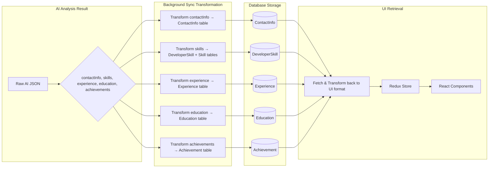

# CV Data Flow (Single Source of Truth Architecture)

This document outlines the **current and definitive** data flow for uploading, analyzing, and persisting CV data using proper single source of truth database tables. 

**🎯 Key Architectural Change**: CV data is now saved directly to proper profile tables (Developer, Experience, Education, Skills) instead of the redundant CvAnalysis table.

## Upload & Analysis Flow

```mermaid
graph TD
    subgraph "Browser"
        A[User uploads CV via UploadForm] --> B{POST /api/cv/upload};
        AA[User edits profile data] --> BB{Redux updateAnalysisData};
        BB --> CC[User clicks save];
        CC --> DD{PUT /api/developer/me/profile};
    end

    subgraph "CV Upload Pipeline"
        B --> C[1. Upload to AWS S3];
        C --> D["2. Create 'CV' record in MongoDB\n(status: PENDING)"];
        D --> E[3. Parse File Content];
        E --> F["4. AI Analysis\n(GPT/Gemini)"];
        F --> G[5. Background Profile Sync];
        G --> H["6. Save DIRECTLY to Profile Tables\n(Developer, Experience, Education, Skills)"];
        H --> I["7. Update CV status to COMPLETED"];
    end

    subgraph "Manual Edit Pipeline"
        DD --> J[1. Transform UI data to profile format];
        J --> K[2. Validate with Zod schemas];
        K --> L["3. Update Profile Tables DIRECTLY\n(Developer, Experience, Education, Skills)"];
        L --> M[4. Return success to UI];
    end

    subgraph "Data Storage (Single Source of Truth)"
        style S3 fill:#FF9900,stroke:#333,stroke-width:2px
        style DB_CV fill:#4DB33D,stroke:#333,stroke-width:2px
        style DB_Profile fill:#4DB33D,stroke:#333,stroke-width:2px
        
        C -- Raw File --> S3[AWS S3 Bucket];
        D -- Metadata --> DB_CV["MongoDB\n'CVs' collection\n(file metadata only)"];
        H -- Profile Data --> DB_Profile["MongoDB\nSingle Source of Truth:\n• Developer\n• Experience\n• Education\n• DeveloperSkill\n• Achievement"];
        L -- Updated Data --> DB_Profile;
    end

    subgraph "Data Retrieval"
        style Redis fill:#D82C20,stroke:#333,stroke-width:2px

        N["Frontend requests data\nGET /api/cv-analysis/latest"] --> O[Fetch from Profile Tables];
        O --> P["Transform to UI format\n(maintains compatibility)"];
        P --> Q[Return to Redux store];
        Q --> R[Display in components];
        
        O --> Redis[Redis Cache\n(semantic caching)];
        Redis --> P;
    end
```

## Data Transformation Pipeline

